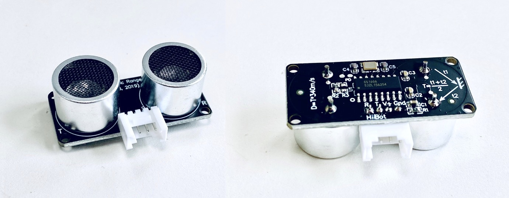

.. _Grove_S16_UltrasonicDistanceMeasuringModule:

====================
Grove接口超声波测距模块(2～400cm)
====================

我们声带发出的声波信号，也就是说话所发出的声音，实际上是一种空气振动波信号。描述波信号的物理量主要有振幅和频率。
人体声带发出的声波信号频率不超过20KHz，所以人们习惯把超过20KHz的声波称作“超声波”，20KHz以下的声波信号被称作“次声波”。
超声波具有非常好的方向性和反射能力，即它能沿着直线传播，遇到障碍物时会反射。人们利用超声波的这两个特性(方向性和反射性)
开发出各种各样的超声波应用，用于测距、测速、清洗、焊接、碎石、杀菌消毒等。

超声波测距传感器不仅利用超声波的方向性、反射性，还利用超声波在空气中的传播速度是一个常数。超声波传感器的外型如下图。

超声波测距传感器由超声波发射器、超声波接收器和声波信号处理单元组成。

使用超声波传感器时，发射器首先发射出一束超声波，当这束超声波遇到障碍物时将会被反射会传感器，这束反射波被接收器所接收。
从超声波发射出去开始计时，当收到反射波时停止计时，计时器所记录的时间间隔正好是超声波在空气中的传播时间。将测量计时器
给出的超声波传播时间乘以超声波在空气中的传播速度(即340m/s)，我们将得到这束超声波的传播路程，这个路程的一半正好就是
超声波传感器与障碍物之间的距离。我们用下图解释超声波是如何测量“传感器与障碍物之间距离”。

.. image:: ../_static/images/GroveModules/UltrasonicDGrove_S16_UltrasonicDistanceMeasuringModuleistanceModule_2.jpeg
    :align: center 

.. note:: 
请注意超声波传感器的局限性：
  * 近距离盲区。当障碍物和传感器之间距离太小，反射波不能进入接收器。盲区的大小受发射器和接收器的安装距离限制。
  * 最大测量距离。超声波是一种能量束，随着传播距离增加能量不断消耗，无法反射到接收器。最大测量距离由发射波的能量大小决定。

-----------------------------------

在Arduino环境使用超声波传感器
=========================

在Scratch环境使用超声波传感器
=========================

