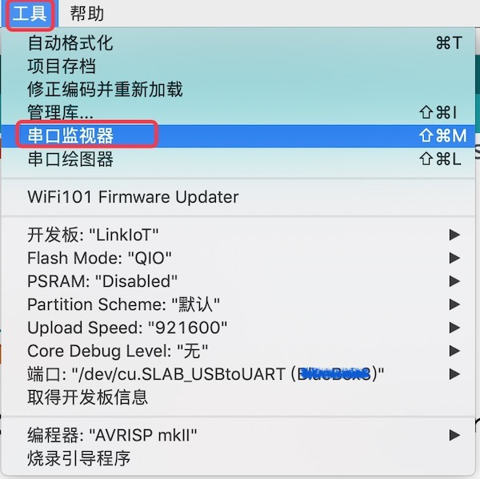
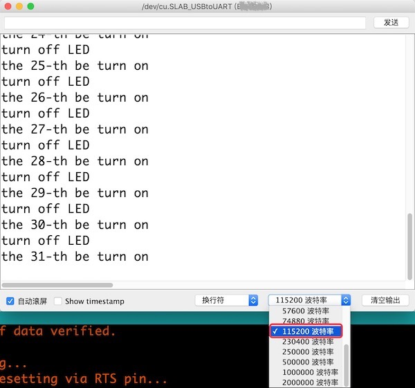

.. _debug_with_serial:

===========================
使用串口调试程序
===========================

灵活使用LinkIoT的串口，对我们调试程序、排除程序的逻辑错误、甚至硬件等问题都是非常有帮助的。
LinkIoT的程序下载端口在电脑端也是一个串口设备，使用Arduino IDE自带的串口监视器、串口绘图仪等功能，我们很容易知道程序执行到那个语句，再根据程序执行结果的现象，能够帮助我们排查程序逻辑问题，甚至硬件问题。

当然，这需要我们修改自己的程序才能实现，在程序中增加一些"输出信息到串口监视器"的语句。

.. code-block:: 
   :linenos:

     #include <LinkIoT.h>
     // blink LED

     void setup() {
        linkIoT.begin();
        linkIoT.TFTBL_Turnoff(); // the TFT LCD not be used in this example
        Serial.begin(115200); // initialize UART0 act as a Serial class device, and set baudrate as 115,200 bps
        Serial.println("demo to blink LED"); // a string with a carriage return character be output to PC  
     }

     void loop() {
        static uint8_t counter=0;
        linkIoT.LED_Turnon();
        counter++;
        Serial.print("the ");  Serial.print(counter); Serial.println("-th be turn on"); // three strings are send to PC
        delay(500);

        linkIoT.LED_Turnoff();
        Serial.println("turn off LED"); // one string are send to PC
        delay(500);
     }

我们首先使用"Serial.begin(115200)"语句初始化UART0，并将波特率定义为115200bps，然后从UART0的TxD引脚输出一个字符串给PC。
在"loop()"循环程序块中，当LED指示灯被点亮时，我们输出三个字符串，分别使用Serial类的"print()"和"println()"两种方法，如此就可以将三个字符串拼成一行显示在PC的串口监视器上；
当LED指示灯被熄灭时，我们输出一个字符串。然后我们将程序编译、下载到LinkIoT板上，下载完毕后打开Arduino IDE的"工具" -> "串口监视器"窗口，你将会看到：

使用串口通讯时，波特率是非常重要的参数，必须确保通讯双方的波特率完全相同。
我们为LinkIoT初始化时将其Serial类的波特率设置为115200bps，Arduino IDE的串口监视器的波特率也必须设置为相同的值，否则窗口监视器上看到的内容并不是我们期望的字符串，而是一些"乱码"，此时只需要用窗口监视器窗口右下角的波特率设置栏进行正确的设置即可。

在调试程序时，我们时常需要知道哪些语句是否已经执行。使用上述的方法，为某些关键的程序块增加"Serial.println()"语句，向电脑的串口输出一些字符串或程序结果数据，我们使用Arduino IDE的串口监视器就可以掌握程序执行到哪里。

