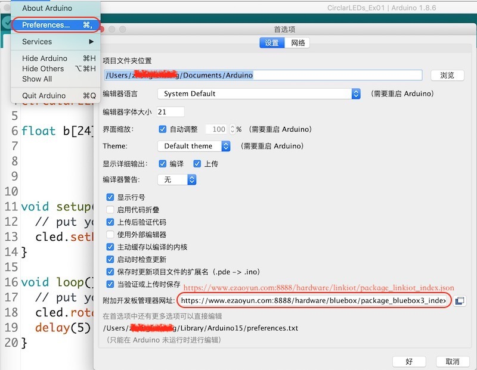
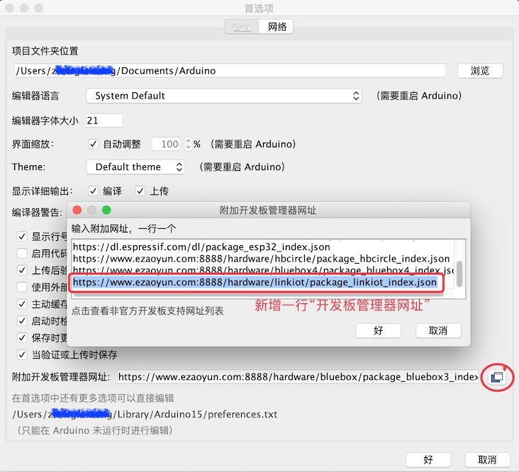
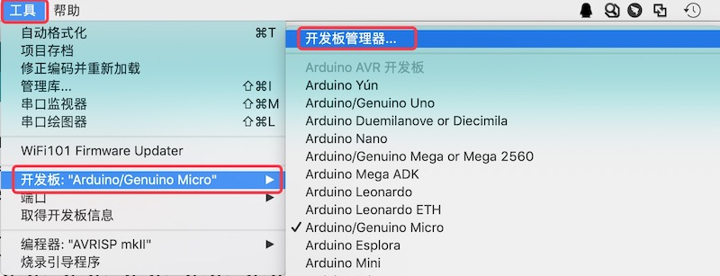
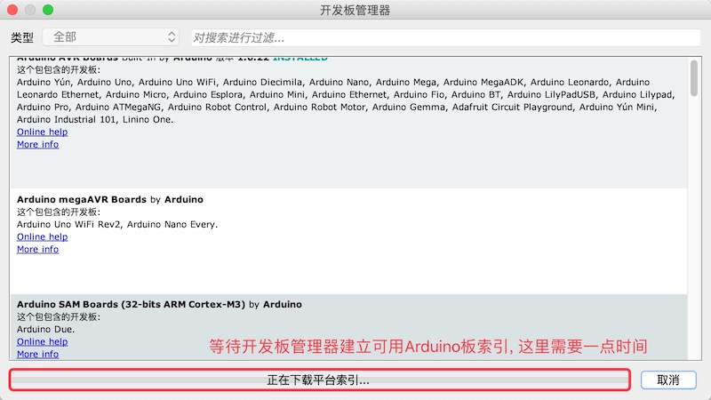
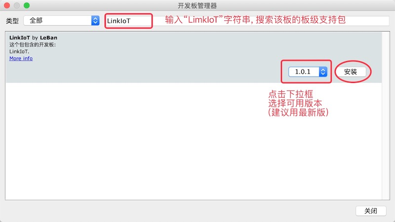
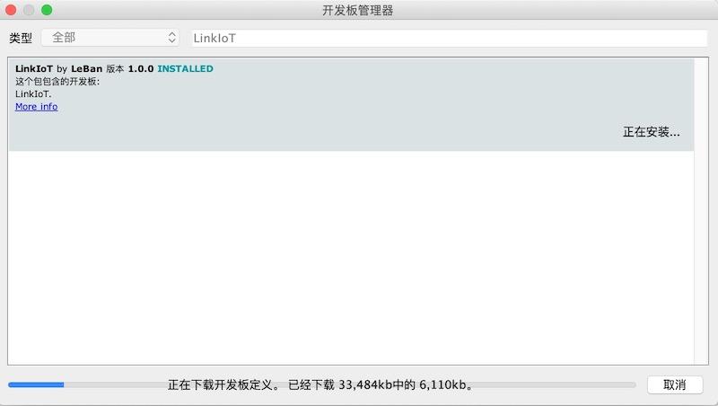
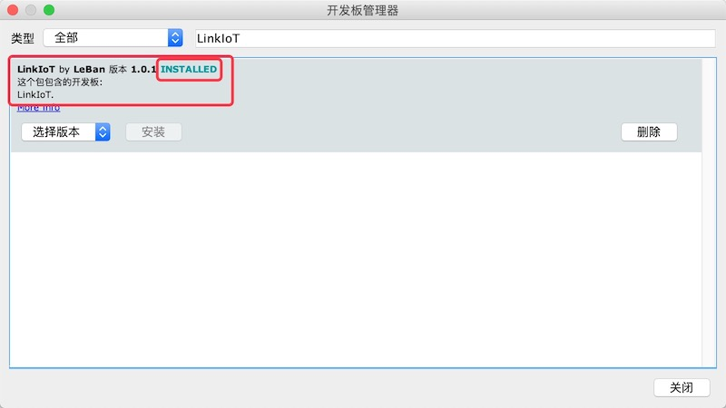
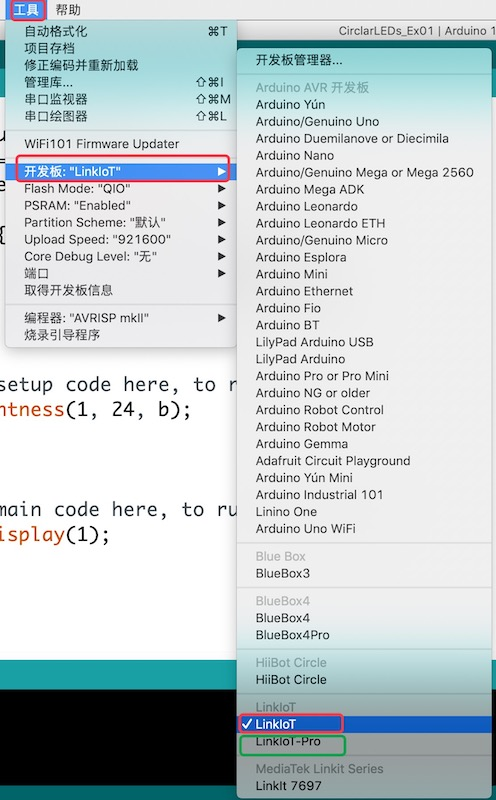
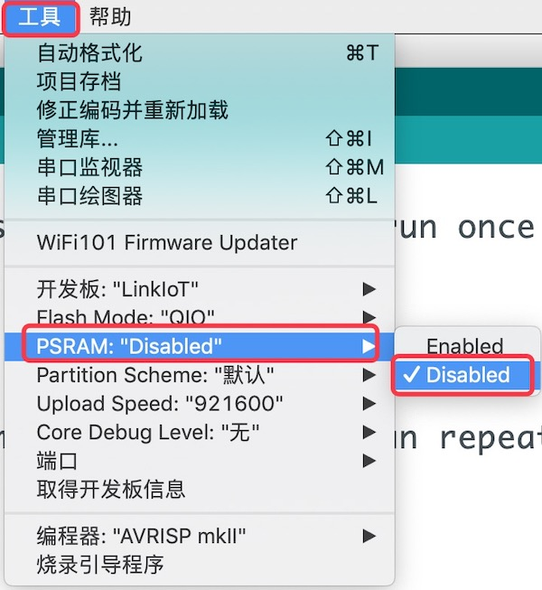
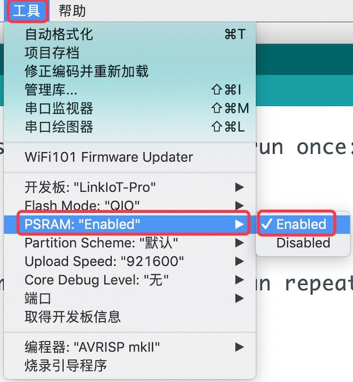

.. _install_bps:

==========================
安装LinkIoT板级支持包(BSP)
==========================

在前一节中，我们已经安装好Arduino IDE，本节我们将要配置Arduino IDE并安装LinkIoT的板级支持包。

增加LinkIoT的管理器网址
=======================

打开Arduino IDE的“首选项”，并编辑“开发板管理器网址”栏目的内容，将下面的网址输入(复制-粘贴)到该栏目:

https://www.ezaoyun.com:8888/hardware/linkiot/package_linkiot_index.json

如果已经在使用其他Arduino开发板，只是将新增一行，不必覆盖其他开发板管理器网址：

安装LinkIoT板级支持包
===================

为Arduino IDE配置好LinkIoT的管理器网址之后，我们可以正式开始安装LinkIoT的板级支持包。
首先，我们需要打开Arduino IDE的“工具” -> “开发板xx” -> "开发板管理器"窗口：

每次打开“开发板管理器”窗口时，Arduino IDE都会创建可用开发板的索引。这一步Arduino IDE需要下载一些文件，
因此需要你耐心等待片刻(等待时间取决于网速)。

当Arduino IDE创建好可用开发板索引之后，我们可以在开发板搜索栏中输入"LinkIoT"，快速找到这个开发板的板级
支持包，选择一个版本后，点击安装即可。

LinkIoT的板级支持包大约35MB，需要一些时间下载。具体时间由你的网速决定。

当我们安装完毕后，你将会看到这个开发板的支持包被Arduino IDE标注为“INSTALLED”。

选择使用LinkIoT板
===============

当我们将LinkIoT的板级支持包安装完毕后，Arduino IDE的“工具” -> "开发板"列表中将会看到LinkIoT板。
现在可以选择使用LinkIoT板。

.. note:: 
   * LinkIoT模块有两种型号：LinkIoT和LinkIoT Pro
   * LinkIoT Pro = LinkIoT + 8MB PSRAM 
   （即，LinkIoT Pro比标准的LinkIoT板多8MB PSRAM)

配置LinkIoT (禁用PSRAM)
===============

由于LinkIoT标准版没有8MB PSRAM，配置选项“PSRAM:”应选择“Disabled”。

.. note:: 
    * 虽然LinkIoT标准版没有包含8MB PSRAM，但板上保留有QSPI接口的SRAM芯片焊接位置，如果你确定需要8MB PSRAM，可以自行购买、焊接。
    * 如果板上没有PSRAM，并将“PSRAM:”选项配置为“Enabled”，Arduino IDE将根据配置选项为应用程序启用PSRAM，这将引起不可预测的错误。

配置LinkIoT Pro (启用PSRAM)
===============

当我们的应用程序需要更多SRAM时，LinkIoT Pro板自带有8MB PSRAM以满足内存开销。当然，只有我们将该开发板
的"PSRAM:"选项配置为“Enabled”时才能启用。

