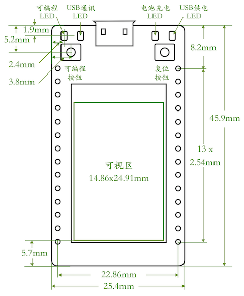

.. _linkiot_intro:

======================
LinkIoT简介
======================

LinkIoT采用240MHz双核SoC(片上系统)——ESP32作为核心，并配置大容量ROM和SRAM，以及1.13寸彩色LCD和
加速度传感器等丰富外设，模仿宽体DIP28封装的双排扩展接口，不仅支持面包板和杜邦线风格的系统搭建方案，
还配有兼容Arduino板的标准2.54mm间距的针、孔连接器，以及十余个工业级标准的4线Grove连接器。

LinkIoT旨在为初学编程者提供一种快捷的智能物联传感系统构建方案，并配备丰富的软件编程环境供不同级别的
使用者选择。

.. note::
    * LinkIoT有两种版本：标准版和增强版
    * 增强版 = 标准版+8MB SRAM

.. rubric:: `LinkIoT购买链接`_

.. rubric:: LinkIoT特色
* 高性能240MHz双核的ESP32
* 4MB FlashROM
* 8MB SRAM (QSPI, 仅Pro版)
* TFT-LCD (135x240点阵)
* 3轴加速度传感器 (根据姿态旋转屏幕)
* USB-Serial桥和AutoBoot逻辑控制单元 (下载程序和串口监视器)
* 可编程的LED
* 可编程的按钮
* 18个GPIO，用于扩展接口
* 支持DI、DO、AI、AO、PWM、Touch
* 支持UART、I\ :sup:`2`\C、SPI、I\ :sup:`2`\S等多种总线型扩展接口
* 开关型DC-DC单元 (输出电压和电流: 3.3V@1.5A)
* 3.7V锂电池充放电管理单元
* 电池电压监测单元
* 板子尺寸：25.4x45.9mm
* 双排扩展接口的跨度：22.86mm (9*2.54mm)

.. rubric:: LinkIoT支持的软件编程环境
* Scratch3.0  (`使用图形化编程语言`_ )
* Arduino IDE (C++)
* MicroPython (Python)
* Espressif IDF (C++)

.. _使用图形化编程语言: https://www.ezaoyun.com/

.. note:: 
   * 本文档仅针对Arduino编程环境
   * `Scratch3.0编程环境的快速向导`_ 请参见Scratch4LinkIoT文档
   * `MicroPython编程环境的快速向导`_ 请参见Python4LinkIoT文档
   * `Espressif IDF编程环境的快速向导`_ 请参见乐鑫官网的相关文档

.. _Scratch3.0编程环境的快速向导: https://www.ezaoyun.com/
.. _MicroPython编程环境的快速向导: https://www.ezaoyun.com/
.. _Espressif IDF编程环境的快速向导: https://docs.espressif.com/projects/esp-idf/en/latest/

.. rubric:: `LinkIoT购买链接`_

.. _LinkIoT购买链接: https://shop377908176.taobao.com/?spm=2013.1.1000126.2.7fe21ca1vC8zAf
.. _购买LinkIoT: https://shop377908176.taobao.com/?spm=2013.1.1000126.2.7fe21ca1vC8zAf

.. rubric:: LinkIoT硬件架构

.. rubric:: LinkIoT尺寸

.. rubric:: `LinkIoT购买链接`_

