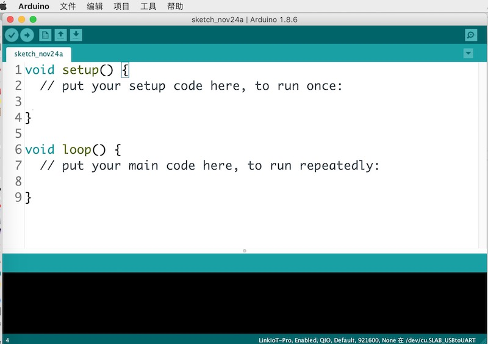
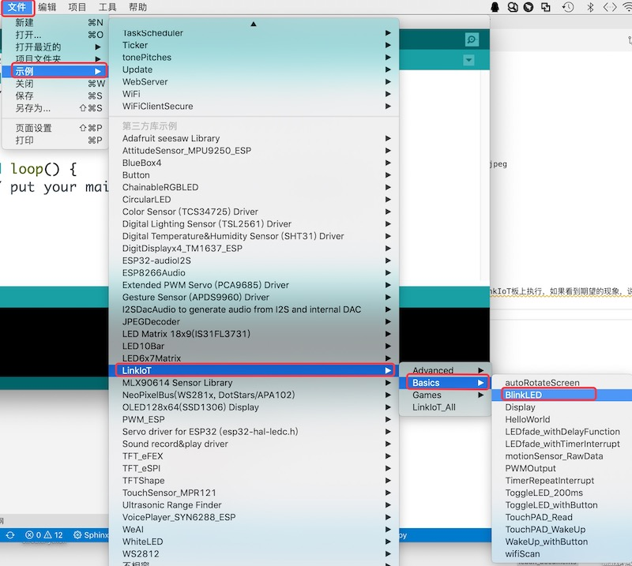
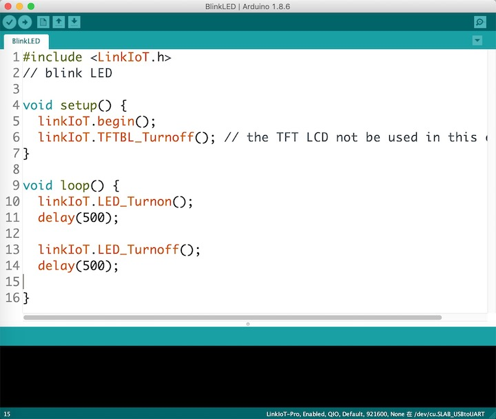
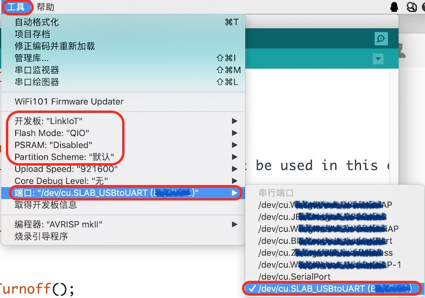
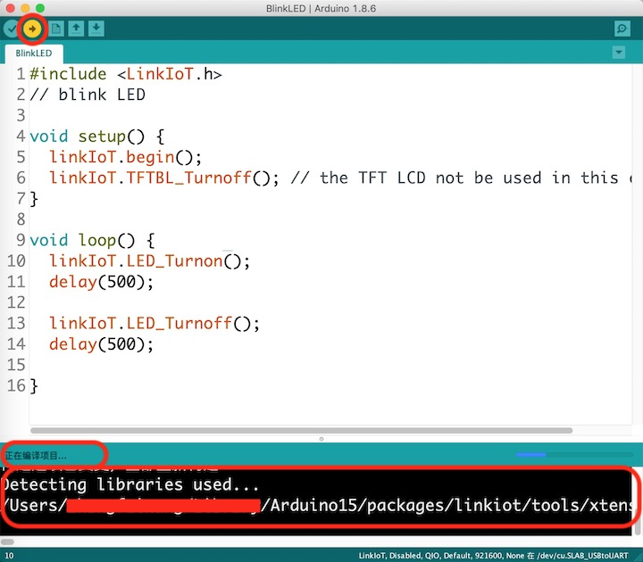
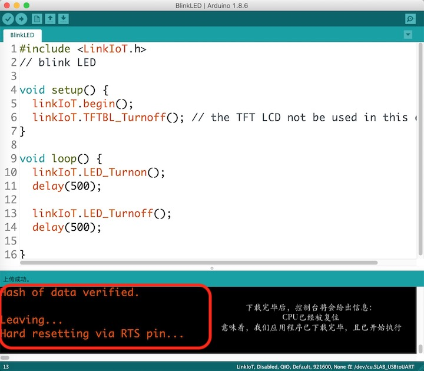

.. _open_download_1stexample:

===============================
打开并下载第一个示例
===============================

首次打开Arduino IDE时，你将会看到一个默认的空程序框架。

如果我们熟悉C/C++语言的编程环境，但第一次使用Arduino IDE，你会觉得有点怪！
这是C/C++语言的程序框架吗？为什么没有main()函数？

不必奇怪。Arduino IDE的确没有显式的main()程序，只有两个程序块：
      * setup()，这个程序块中的程序语句只会执行一次，而且是在复位后最先被执行的代码。
      * loop()，这个程序块中的程序语句将会被循环执行

首次使用Arduino IDE或LinkIoT时，建议打开LinkIoT的示例程序，然后编译并下载程序到LinkIoT板上执行，如果看到期望的现象，说明我们之前的Arduino安装和配置都是正确的。

示例程序的源码如下。如果你看不到这个示例的源码，可以用复制-粘贴的形式自己创建这个示例程序。

.. code-block:: 
   :linenos:

      #include <LinkIoT.h>
      // blink LED

      void setup() {
      linkIoT.begin();
      linkIoT.TFTBL_Turnoff(); // the TFT LCD not be used in this example
      }

      void loop() {
      linkIoT.LED_Turnon();
      delay(500);
      
      linkIoT.LED_Turnoff();
      delay(500);
      }

这个示例程序的初始化仅有两个功能：(1) 调用LinkIoT的板级支持包中"begin()"对LinkIoT板进行初始化；(2) 然后关闭本示例不使用的TFT-LCD显示屏。
请注意Arduino的"setup()"程序块中的程序语句只执行一次。"setup()"程序块的初始化程序执行完毕后，开始执行"loop()"循环程序块，这个程序块是一个“死循环”！我们循环执行：打开LinkIoT的LED，等待500ms，然后关闭LED，等待500ms。
这个示例程序的循环执行效果就是，LinkIoT板上的可编程LED以1s为周期地闪烁。

这是一个非常简单的示例程序，我们很容易想象其执行结果。那么，LinkIoT实际的执行结果与我们想象的一样吗？需要将程序下载到LinkIoT板上进行验证。

下载示例程序前，需要使用USB数据线将LinkIoT板与计算机连接起来，并根据电脑的"设备管理器"是否新增“COMxx”端口(Windows系统)或"/dev/cu.xxxx"(macOS和Linux系统)设备来确认连接的有效性。
Arduino IDE也会自动列出可用的串行端口。

正确选择LinkIoT的程序下载端口之后，我们就可以将本示例程序编译、下载到LinkIoT板上并自动执行，观察LinkIoT的执行结果是否与想象的一致。
点击Arduino IDE的"上传"按钮，Arduino IDE首先根据我们的配置信息开始编译本示例程序。

编译完毕后，Arduino IDE将自动将本示例程序下载到LinkIoT板的ROM中，最后再复位CPU，让CPU开始执行我们的程序。

此时，如果我们能看到LinkIoT的蓝色/绿色LED指示灯以1s为周期闪烁。这说明我们已经将Arduino IDE和USB驱动等都安装和配置完毕。
