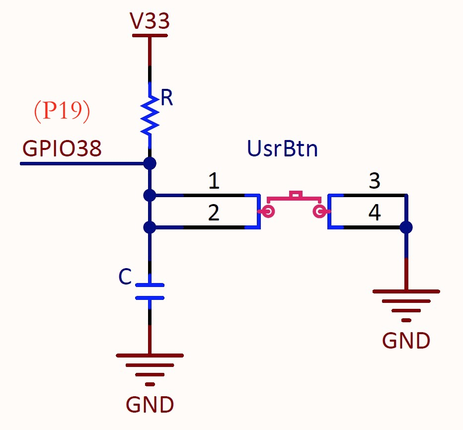

.. _onboard_button:

=====================
可编程按钮 (BUILTIN_BTN)
=====================

LinkIoT板上有两个按钮：1)复位按钮； 和 2)用户可编程按钮

    * 复位按钮，在LinkIoT的右侧(USB端口向上)
    * 用户可编程按钮，在LinkIoT的左侧

"计算机的复位操作"是众所周知的。按下LinkIoT复位按钮将立即强制LinkIoT重新开始执行程序，无论LinkIoT处于什么状态。
LinkIoT板上的用户可编程按钮与ESP32的GPIO38引脚连接，被按下时为低电平。电路原理如下图，

使用LinkIoT板载的可编程按钮有两种方法，

.. note::  
   * 使用digitalRead接口函数确定按钮当前的状态: statusUsrButton = digitalRead(BUILTIN_BTN)
   * 使用LinkIoT的Button类接口函数确定按钮的状态变化: linkIoT.btn.isPressed(),  linkIoT.btn.wasPressed(), linkIoT.btn.isPressed()

