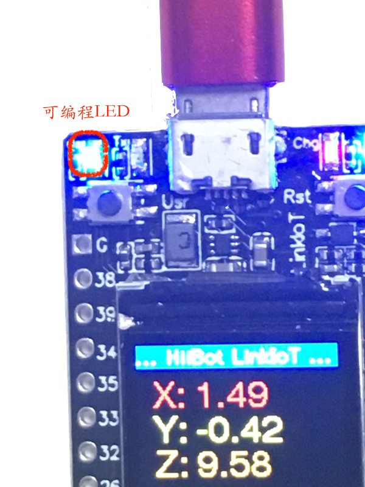
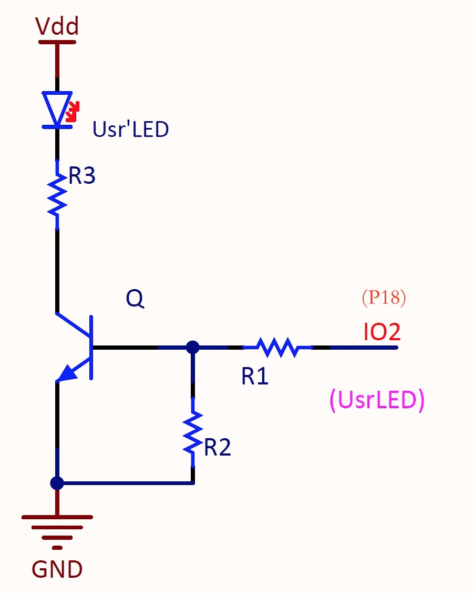

.. _onboard_led:

===============================
可编程LED (BUILTIN_LED)
===============================

()

我们在 `快速向导的第5章`_ 的示例中已经能够控制LinkIoT板上的可编程LED指示灯闪烁。
闪烁LED的程序，与"hello world"示例程序很相似。几乎所有高级编程语言的初学者的第一个示例程序都是"Hello World"，几乎所有嵌入式系统的初学者的第一个示例程序都是闪烁LED！
让LED指示灯亮，延时数百毫秒；让LED指示灯灭，延时数百毫秒。初始化之后，只需要在"循环"程序块中填入几个语句即可实现"嵌入式世界的'Holle World'"效果，表示我们已经进入嵌入式世界。

.. note::  
   * API name: LED_Turnon() 
   * API name: LED_Turnoff()

.. _快速向导的第5章: https://arduino4linkiot.readthedocs.io/en/latest/intro/open_download_1stexample.html

在本节，我们将更深入地了解LinkIoT的可编程LED，并开始逐步探索LinkIoT的API.

Toggle LED (简化版的LED闪烁程序)
==========

回想之前已经掌握的"编译、下载应用程序"的过程。复制以下代码，并创建一个新的Arduino应用程序，建议取名"ledToggle"。

.. code-block:: 
   :linenos:

 #include <LinkIoT.h> 
 void setup() {
    // put your setup code here, to run once:
    linkIoT.begin();
    Serial.begin(115200);
    Serial.println("Demo to pragrammable LED, adjust its brightness");
 }

 void loop() {
    // put your main code here, to run repeatedly:
    linkIoT.LED_Toggle();
    delay(500); // delay 500 ms
 }

让LinKIoT运行这个应用程序时，我们看到的效果几乎与"闪烁LED"程序完全相同！
但是，这个示例程序的"loop()"程序块中我们仅使用2个语句，即"linkIoT.LED_Toggle()"和"delay(500)"就能达到"闪烁LED"的效果。
很显然，LinkIoT的API接口"LED_Toggle()"就是切换LED亮和灭的方法。望文生义，这个API就是切换LED的亮和灭。

.. note:: 
   * API name: LED_Toggle()
   * input parameters: none
   * output parameters: none
   * return value: none

调节LED亮度
==========

日常生活中，可调节亮度的灯很常见。在LinkIoT板上的可编程LED的亮度调节需要使用PWM。

.. note:: 
   * PWM(Pulse-Width Modulation)，脉宽调制
   * PWM的基波频率，指的是脉冲频率
   * PWM的占空比，指的是脉冲的高电平时间与脉冲周期的比值。如1/2占空比，指的是高电平时间为周期的一半

使用PWM输出信号可以调节LED的亮度，实际上是调整PWM信号的占空比，用于调节LED亮度的PWM信号的脉冲频率一般选择0.5~2KHz。

.. code-block:: 
   :linenos:

 #include <LinkIoT.h> 
 void setup() {
    // put your setup code here, to run once:
    linkIoT.begin();
    Serial.begin(115200);
    Serial.println("Demo to pragrammable LED, adjust its brightness");
 }

 void loop() {
    // put your main code here, to run repeatedly:
    linkIoT.LED_Brightness(100); // set brightness of LED 
    delay(500); // delay 500 ms
    linkIoT.LED_Brightness(0);
    delay(500); // delay 500 ms
 }

执行上面代码的效果将会看到"闪烁LED"的效果。这是因为，我们在循环程序中重复执行"将LED亮度设置为100，延时0.5s，再将LED亮度设置为0，延时0.5s"。

.. note:: 
   * API name: LED_Brightness(uint8_t bv)
   * input parameters: bv, uint8_t类型, 有效范围0～255
   * output parameters: none
   * return value: none

会呼吸的LED
=========

接下来，我们使用PWM调节LED亮度的方法来实现"会呼吸的LED"效果。

.. code-block:: 
   :linenos:

  #include <LinkIoT.h>
  void setup() {
     linkIoT.begin();
     Serial.begin(115200);
     Serial.println("Demo to pragrammable LED, fade LED");
  }

  void loop() {
     static int16_t bright=0;
     static bool inc=true;
     linkIoT.LED_Brightness(bright);
     
     if (inc) {
        bright += 5;
        if (bright >= 200) {
          inc = false;
          bright = 200;
        }
     }
     else {
        bright -= 5;
        if (bright <= 0) {
          inc = true;
          bright = 0;
        }
     }
     delay(30);
  }

